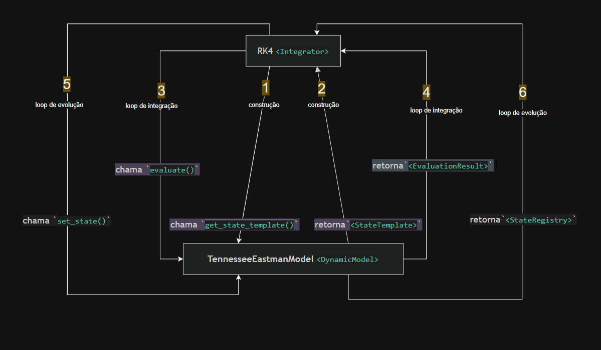

# Avaliação da refatoração: padrão Composite no te-core

## Integrator ↔ DynamicModel

Essa relação é o **Contrato de Integração** entre o `Integrator` (RK4) e qualquer `DynamicModel` (`TennesseeEastmanModel`). Ela acontece em três fases, cada uma um par chamada/resposta, não uma chamada solta: construção (1-2), loop de integração (3-4) e loop de evolução (5-6). O ponto central é que o RK4 nunca assume nada sobre o modelo além desse contrato — ele não sabe quantos estados existem, não sabe como as derivadas são calculadas internamente, e não sabe como o novo estado é persistido. Tudo isso é responsabilidade do `DynamicModel`; o RK4 só orquestra as chamadas na ordem certa.

Na **construção**, o RK4 chama `get_state_template()` uma única vez, antes de qualquer integração, e recebe um `StateTemplate`. É aqui que o modelo informa seu próprio layout (tamanho do vetor de estado, e possivelmente os offsets de cada componente interno) — o RK4 não hardcoda esse número em lugar nenhum. No **loop de integração**, a cada passo (e, no caso do RK4 clássico, a cada um dos quatro estágios k1-k4) o RK4 chama `evaluate()` passando o estado atual e recebe um `EvaluationResult` — as derivadas naquele ponto. É exatamente aqui que a discussão anterior sobre DAG/`EvaluationPlan` se aplica: por baixo do `evaluate()`, o `DynamicModel` executa sua sequência causal interna (Reactor → Separator → Stripper/Compressor → Flows → Heat → derivadas) sem que o RK4 precise saber que isso existe.

No **loop de evolução**, depois de combinar os quatro estágios do RK4 na forma ponderada usual, o RK4 chama `set_state()` para aplicar o novo estado calculado dentro do modelo, e recebe de volta um `StateRegistry` — a confirmação/snapshot do estado já persistido. É esse retorno que fecha o ciclo: garante que o próximo passo de integração vai partir de um estado internamente consistente (inclusive nos buffers auxiliares como `mole_fractions`/`stream_temperatures`, que hoje vivem em `self` e não no vetor de estado devolvido pelo RK4). Sem esse terceiro passo explícito, o RK4 teria que assumir que escrever no vetor de estado é suficiente — o que já vimos não ser verdade para o TEP atual.

## DynamicModel ↔ DynamicModel

Essa é a relação de **Contrato de Composição**: `TennesseeEastmanModel` é um `DynamicModel` especial, porque é composto; ele usa o método `add_component(n: DynamicModel)` que recebe Reactor, Separator, Stripper, Compressor, Agitator e Valve — cada um deles, sem exceção, implementando o mesmo `DynamicModel` do Contrato de Integração (mesmo `evaluate()`, mesmo `get_state_template()`, mesmo `set_state()`). Do ponto de vista do RK4 nada muda: ele continua vendo um único `DynamicModel` no topo (facade). A composição inteira — quem chama quem, em que ordem, com quais dados — é interna ao `TennesseeEastmanModel` e invisível para fora.

O que resolve o acoplamento algébrico entre Reactor/Separator/Stripper/Compressor não é a interface `DynamicModel` em si, mas o que o `add_component` vai carregar junto: além de registrar o filho, cada chamada vai indicar sua posição no plano de avaliação (o `EvaluationPlan`/`ExecutionGraph` de que falamos antes). Quando `TennesseeEastmanModel.evaluate()` for chamado pelo RK4, ele vai percorrer esse plano em ordem — Reactor, depois Separator, depois Stripper e Compressor, depois o bloco de fluxos — chamando o `evaluate()` de cada filho e repassando adiante os dados que esse filho expôs para quem vem a seguir. Cada componente continua só enxergando seu próprio pedaço de estado mais os dados que a camada de resolução já deixou prontos para ele; ele não sabe nada sobre os outros filhos nem sobre a ordem geral.

Sensor e Disturbance **não** entram nessa árvore como `DynamicModel`. Sensor fica de fora porque ele não participa da avaliação — ele só lê o estado depois que o `TennesseeEastmanModel` já resolveu tudo, papel que cabe à relação `Outside ↔ DynamicModel`/`AcquisitionLayer`, não ao `add_component`. Disturbance fica de fora por um motivo diferente: ele não é dono de um componente, ele atravessa vários ao mesmo tempo (reação no Reactor, UA do condensador e vazão nos Flows, coeficientes de troca no Heat). Um distúrbio não tem um único lugar na árvore de composição onde caiba como filho — por isso ele vai ser tratado como entrada injetada, associada a cada componente que o consome, e não como mais um `n<DynamicModel>` do `add_component`.

## DAG é suficiente para o caso geral, ou só para o TEP?

> DAG = Directed Acyclic Graph
> DAE = Differential-Algebraic Equation

Vale separar duas perguntas: "esse DAG resolve o TEP?" (sim, como já visto acima) de "DAG é a arquitetura certa para simulação de plantas em geral?" (não). Plantas reais frequentemente têm reciclos, malhas hidráulicas e dependências circulares que não cabem em uma ordem topológica fixa. Para o escopo atual — TEP, integração via RK4, variáveis intermediárias calculadas proceduralmente numa ordem causal explícita — um DAG/`EvaluationPlan` dá conta perfeitamente. Mas para plantas mais gerais com equilíbrio de rede hidráulica, flash acoplado, reciclo forte ou relação pressão-vazão implícita, um DAG simples quebra: nesse ponto o problema deixa de ser "em que ordem eu chamo os componentes" e passa a ser um sistema algébrico/DAE que exige solver iterativo, Newton ou *tearing* — não apenas uma sequência linear.

Isso não contradiz o fato de o TEP ter reciclo físico (a corrente de saída do compressor volta ao reator): reciclo físico não implica ciclo algébrico no cálculo do mesmo instante. No código atual, o reciclo existe, mas vazões e composições são calculadas usando estados já conhecidos e uma ordem causal explícita — `TepReactor` não precisa de nada que `TepFlows` produza, e vice-versa dentro do mesmo passo. O problema algébrico só apareceria se a variável `A(t)` de um bloco precisasse simultaneamente da variável `B(t)` de outro *e* `B(t)` precisasse de `A(t)` — nesse caso não existe uma ordem de chamada que resolva os dois de uma vez, e seria necessário iterar.

### Solves Iterativos

Um exemplo concreto desse caso (que o TEP atual não tem, mas que aparece em outras plantas) é uma rede de tubulação com dois tanques conectados por uma válvula, onde a vazão depende da diferença de pressão (`F = Cv * sqrt(PA - PB)`), mas as próprias pressões `PA` e `PB` dependem dos níveis, que por sua vez dependem de `F` no mesmo instante. Se `PA` e `PB` puderem ser calculados diretamente a partir de estados já conhecidos, ainda é um DAG; mas se `PA`, `PB` e `F` precisarem ser resolvidos simultaneamente por uma restrição de rede hidráulica, a cadeia de dependência vira um ciclo (`PA → F → PB → F`) e não existe mais uma ordem linear simples. Isso é típico de redes de vapor, redes de água de resfriamento, redes de gás comprimido, oleodutos/gasodutos, ou uma planta química com vários vasos conectados por válvulas onde as pressões são acopladas pela rede inteira — matematicamente isso vira uma DAE (`0 = g(y, z, t)`) resolvida por solver iterativo, e não algo que um `EvaluationPlan` linear consiga expressar.

Um solver iterativo resolve esse ciclo trocando "avaliar uma vez, na ordem certa" por "chutar, avaliar, corrigir, repetir". Como `PA`, `PB` e `F` não podem ser calculados um a partir do outro sem circularidade, o método começa com um palpite para a variável que fecha o ciclo (por exemplo, `F`), avalia o resto do grafo normalmente como se fosse um DAG a partir desse palpite, e mede o quanto o resultado final diverge do valor assumido no início — o resíduo. Se o resíduo não for zero, o palpite é ajustado e o grafo inteiro é reavaliado; isso se repete até o resíduo cair abaixo de uma tolerância aceitável. Ou seja, a iteração não elimina o ciclo, ela o transforma num problema de ponto fixo: em vez de calcular a resposta certa de uma vez, você converge para ela.

- O método de Newton entra como uma forma mais eficiente de escolher o próximo palpite: em vez de tentar um valor arbitrário a cada rodada (substituição sucessiva, que converge devagar e às vezes nem converge), ele usa a derivada do resíduo em relação à variável (o Jacobiano) para saltar direto na direção que deveria zerar o resíduo, convergindo em muito menos iterações — importante quando a equação é não linear como a raiz quadrada de `PA - PB`. 
- *Tearing* é uma variação pensada para sistemas grandes e esparsos (típico de simuladores de processo): em vez de iterar sobre todas as variáveis do grafo, você escolhe deliberadamente qual aresta "rasgar" (a corrente com o palpite, `F` no exemplo) e itera só sobre essa variável isolada, reavaliando o resto como DAG a cada tentativa — isso reduz drasticamente o tamanho do sistema que precisa de iteração, em vez de resolver tudo de uma vez como um sistema acoplado gigante.

## Outside ↔ DynamicModel