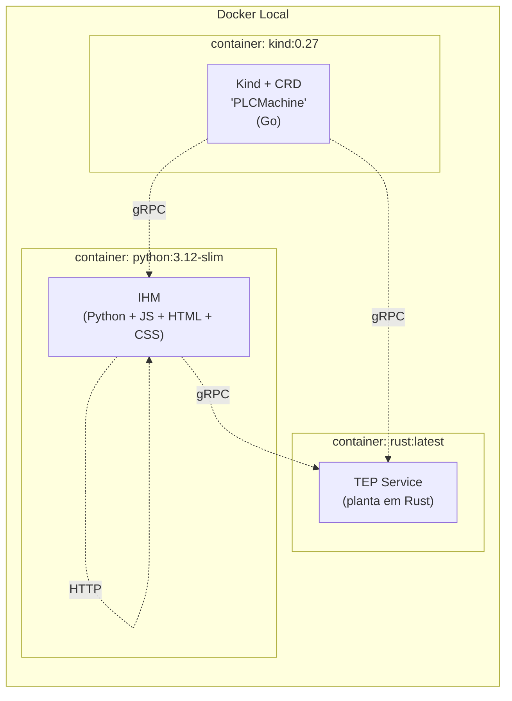
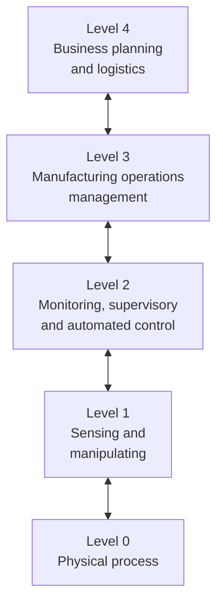

# Kickoff — Implementação OPC-UA (Issue #55)

**Data:** 2026-06-29
**Issue mãe:** https://github.com/Green-Cinnamon-Labs/spec-tennessee-eastman/issues/55

---

## Contexto e motivação

Eu na verdade nem conhecia o OPC-UA. Depois que fiz uma revisão poderosa do referencial teórico, vi muitas citações a o OPC-UA, principalmente no artigo sobre o UNICOS — framework de integração do CERN. Então, eu tive que dar uma lida. Daí eu passei o olho em algumas partes da norma, especificamente a parte 1, 3 e 8. Eu entendi que se tratava de uma coisa que eu poderia simplesmente fazer nesse projeto.

## O que eu aprendi sobre IEC 62541 / OPC-UA

Para ser sincero, eu não aprendi tudo. É bem extenso. Eu li essas duas partes e deixo até referências em baixo para algumas notas que fiz. Eu sei que existem padrões de objetos, que tenho que ter uma modelagem conceitual disponível, que tenho que implementar serviços específicos de discovery. Eu li muita coisa.

## Ideias iniciais de arquitetura

É basicamente uma proposta sobre como implementar as coisas que já estão aqui, que aliás estão bastante sem padrão. Primeira coisa que pensei é em fazer OPC-UA em cima de gRPC. Até onde sei, a arquitetura e os componentes estão assim:

Então essas API's de integração gRPC devem ser no padrão OPC-UA. Eu penso que a integração não deva ser direta inclusive. Hoje eu informei onde encontrar a API, mas pelo que li, na prática existe o `OPC-Service` e o `OPC-Client`. O Client tem que saber o que procura e ele talvez recora a métodos e aos services de descoberta. Então eu também suponho que vá ter que implementar alguns pequenos serviços.

## O que precisa mudar em cada repo

Todos os 3 — para ser sincero estou na dúvida a respeito do CRD k8s: 
- https://github.com/Green-Cinnamon-Labs/tep-plant
- https://github.com/Green-Cinnamon-Labs/tep-ihm
- https://github.com/Green-Cinnamon-Labs/tep-operator

O k8s em si, no meu caso é o `kind`, não precisa de nada. É a instalação do CRD que o dará esse poder. Eu precise talvez elaborar um pouco algumas das abstrações que discuto em `Diagnóstico de Qualidade de Malhas` — C:\projetos\pessoal\tep-monografia\latex\trabalho\Cap2-referencialteorico.tex. Talvez eu precise fazer algumas coisas bem básicas nesse sentido só para implementar uma política básica de supervisão.

na planta e na IHM é onde espero as maiores mudanças. Na planta, é expor alguns services. Ela não consome nada! Não irei implementar clientes e services internos nela — poderia ser o caso, porque teoricamente os sensores, atuadores e controladores que pertencem a camada de controle contínuo (level 2 de Purdue) estariam conectados nessa dessa forma — somente da planta para a IHM e k8s, ou seja, me restringiria a implementar nessa escalada de level 2 → level 3. Inclusive, limitaria a essa direção, não faria nada do k8s afetando level 2, só iria fazer ele observar. 

## Dúvidas e decisões em aberto

<!-- Vou registrar as dúvidas conforme aparecerem -->

## Referências

- C:\projetos\pessoal\tep-monografia\referencial\standard\IEC_62264-1.pdf
- C:\projetos\pessoal\tep-monografia\referencial\notes\ft_IEC_62264-1.md
- C:\projetos\pessoal\tep-monografia\referencial\standard\IEC_62541-1.pdf
- C:\projetos\pessoal\tep-monografia\referencial\notes\ft_IEC_62541-1.md
- C:\projetos\pessoal\tep-monografia\referencial\standard\IEC_62541-3.pdf
- C:\projetos\pessoal\tep-monografia\referencial\notes\ft_IEC_62541-3.md
- C:\projetos\pessoal\tep-monografia\referencial\standard\IEC_62541-8.pdf
- C:\projetos\pessoal\tep-monografia\referencial\notes\ft_IEC_62541-8.md
- C:\projetos\pessoal\tep-monografia\referencial\books\book2_Introduction-OPC-Unified-Architecture_Mahnke,_Leitner_Damm.pdf
- C:\projetos\pessoal\tep-monografia\referencial\notes\ft_OPC-UA-Introduction_Mahnke_Leitner_Damm.md
- C:\projetos\pessoal\tep-monografia\referencial\books\book2_Services-OPC-Unified-Architecture_Mahnke,_Leitner_Damm.pdf
- C:\projetos\pessoal\tep-monografia\referencial\notes\ft_OPC-UA-Services_Mahnke_Leitner_Damm.md
- C:\projetos\pessoal\tep-monografia\referencial\books\book2_System-Architecture-OPC-Unified-Architecture_Mahnke,_Leitner_Damm.pdf
- C:\projetos\pessoal\tep-monografia\referencial\notes\ft_OPC-UA-System-Architecture_Mahnke_Leitner_Damm.md