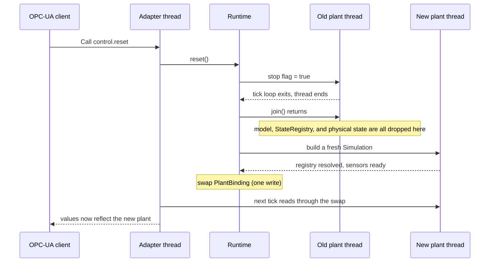
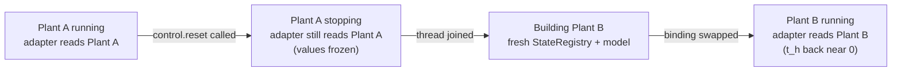

# Runtime Supervisor — the concepts behind the redesign (Issue #61)

**Issue:** https://github.com/Green-Cinnamon-Labs/spec-tennessee-eastman/issues/61
**Date:** 2026-09-08

---

This note exists because we designed something in conversation — a `Runtime` supervisor that lets
`reset` throw away the running plant without dropping the OPC-UA connection — and the design leans
on a handful of Rust concurrency concepts (`Arc`, `RwLock`, the difference between `FnOnce` and
`Fn`) that don't have an obvious equivalent if you haven't worked with Rust before. Rather than just
restating the five design answers I already gave in chat, this walks through *why* each piece is
needed, in the order the problem actually forces them on you. By the end it comes back around and
answers the same five questions, but this time the reasoning should be visible instead of asserted.

## Why this matters

The concrete thing you asked for was simple to state: a "reset" button on the dashboard shouldn't
make `tep-ihm`'s OPC-UA connection drop and reconnect. The reason today's code can't do that isn't a
missing feature so much as a structural fact about how `Simulation::run()` is built. Look at its
signature: `pub fn run(mut self) -> Result<(), String>`. It takes `self` by value and consumes it —
once you call `run()`, that `Simulation` is gone, and the call doesn't return until the whole thing
is over (a fatal error, a panic, or in principle a clean stop that never actually happens today).
Inside that one call, `spawn_plant_thread` does two jobs at once: it runs the physics tick loop, and
— if you configured an adapter — it also spawns the OPC-UA server thread. The two are bolted
together inside a single blocking call.

That means there is currently no way to "restart just the physics" without also ending the call that
owns the OPC-UA server. If `run()` returns, the adapter thread it spawned is either already gone or
about to be orphaned. Whatever "reset" ends up meaning, it has to start from fixing this: the thing
that manages the OPC-UA server's lifetime and the thing that manages one run of the physics need to
stop being the same object.

## Two threads, one sharing problem

There's a FastAPI/asyncio note elsewhere in this repo (`docs/forDummies/nota_fastapi_async_arquitetura.md`)
that explains concurrency *inside a single Python thread* — coroutines taking turns on one event
loop, no real parallelism. What's happening in `tep-plant` is a different and simpler-sounding thing
that actually has sharper edges: two genuine operating-system threads, running at the same time, on
possibly different CPU cores. One is the "plant thread" — the tick loop in `spawn_plant_thread`,
advancing the chemistry every `tick_interval`. The other is the "adapter thread" — the OPC-UA server,
answering `Read`/`Write`/`Call` requests from whatever client is connected. Neither one waits its
turn for the other; they're just both running, independently, all the time.

The problem is that they need to look at the *same* data. The adapter has to read whatever
temperature or pressure the plant thread most recently computed; when a client writes to a valve
node, that command has to reach the plant thread. If you just let two real threads freely read and
write the same plain memory with no coordination at all, you get what's called a **data race**: one
thread can observe a value in the middle of being changed by the other — not "the old value" or "the
new value," but something in between that never should have existed, because most values (a `String`,
a struct with several fields, even some numbers on certain hardware) aren't updated in one
indivisible step. In C or C++ this compiles fine and fails unpredictably at runtime, which is part of
why concurrent bugs have such a bad reputation. Rust's actual selling point here is that it refuses
to compile code that shares plain mutable memory across threads at all — you're forced to reach for
one of a small set of types specifically designed to make sharing safe. `Arc` and `RwLock`, which
show up all over `monjolo`'s adapter code, are two of those types, and the rest of this note is about
what each one actually buys you.

## `Arc`: a shared owner

`Arc<T>` stands for **A**tomically **R**eference-**C**ounted. Rust doesn't have a garbage collector
the way Java does — there's no background process periodically figuring out what's still reachable.
Instead, every value normally has exactly *one* owner, and it gets cleaned up the instant that owner
goes away. `Arc<T>` is the escape hatch for when one owner genuinely isn't enough: it wraps a value
together with a counter, and every time you `.clone()` the `Arc`, you're not copying the underlying
data — you're handing out another pointer to the *same* value and bumping the counter. Each clone can
live on a different thread. The value itself only actually gets dropped once the last clone is gone
and the counter hits zero. That's why you see `Arc<dyn Sensor>` crossing from the plant thread into
the adapter thread in the existing code (`monjolo/adapter/opcua.rs`): both threads are legitimate,
simultaneous owners of the same sensor object, and neither has to worry about the other one deleting
it out from under it.

What `Arc` does *not* do is stop two threads from fighting over what's *inside* the value. It answers
"who's allowed to keep this alive," not "who's allowed to change it right now." For a value that
genuinely never changes after it's created (like `RuntimeControl`'s individual atomic fields, which
each already know how to update themselves safely), that's all you need. But the design we sketched
needs something bigger to change wholesale — a whole bundle of sensors, actuators, and control
handles, replaced all at once — and for that, `Arc` alone isn't enough.

## `RwLock`: many readers, one writer

If you've used Java's `ReentrantReadWriteLock`, this is the same idea. A `RwLock<T>` (read-write
lock) lets any number of readers hold it at the same time — they're all just looking, not changing
anything, so there's no conflict between them. The moment someone wants to *write*, though, they need
exclusive access: no other reader, and no other writer, can be touching the value at that instant.
Picture a whiteboard several people are reading at once — that's fine, nobody's in anyone's way. Now
picture someone walking up to erase a word and write a new one. If a reader is mid-glance at exactly
that spot, they might see "CANCEL" half-erased into "CAN" and read something that was never actually
written. A read-write lock is the rule that says: while the eraser is out, everyone else has to look
away for a moment.

This maps almost exactly onto what the adapter needs. It reads constantly — once per tick, roughly
every 500ms, pulling values for all ~54 nodes — and writes only rarely, exactly when a reset happens.
A lock that lets all those frequent reads happen freely and only demands exclusivity for the one rare
write is precisely the right shape for this problem, which is why `RwLock` (specifically
`std::sync::RwLock` — no new dependency needed) is the tool for the swap, not a plain mutex that
would serialize even the reads against each other for no reason.

## Why swap everything at once, in a single `Arc`

Here's where `Arc` and `RwLock` combine into the actual mechanism, and where a subtler bug becomes
possible if you're not careful about *what* you wrap. The adapter needs access to four things that
all belong to "whichever plant is currently running": the sensor catalog, the actuator "shadow"
sensors (the read-back trick already used today so a written valve position shows up again), the
channel it uses to send write commands into the plant thread, and that plant's `RuntimeControl`
handle (pause/resume/speed/`t_h`). If each of those four lived in its *own* separate `RwLock`,
swapped one after another during a reset, there's a window in the middle where a reader could pick up
the *new* sensors but the *old* command channel — a combination that never should exist, because that
old channel's receiving end already died with the plant thread it belonged to. A write sent into it
would just silently vanish.

The fix is to never let that partial state exist in the first place: bundle all four pieces into one
struct — call it `PlantBinding` — and put the *whole struct* behind one `Arc`, itself behind one
`RwLock`. A reset then does exactly one write: `*binding.write().unwrap() = Arc::new(new_binding)`.
Every read the adapter does is one lock-and-clone of that single `Arc`, which means every read sees
either the *entire* old bundle or the *entire* new one — there is no in-between state to observe,
because there's only one pointer being swapped, not four. It's the same reason you don't change a
car's tires one at a time while it's still moving: you'd rather have a brief, well-defined moment
where all four change together than a longer window where the car is running on a mismatched set.

## What `Simulation` does now, and what becomes `Runtime`

With `Arc` and `RwLock` in hand, the responsibility split from the first design answer makes more
concrete sense. `Simulation` shrinks down to exactly what its name says: it's the builder and runner
for *one* run of the physics — config path, model factory, `dt_hours`, `tick_interval`, numerical
method, and its own `RuntimeControl` scoped to that one run. It no longer knows OPC-UA exists at all.
Instead of a single blocking `run()` that does setup, ticking, *and* adapter management in one
call, it needs a non-blocking `spawn()`-style entry point that hands back a join handle and that run's
`RuntimeControl`, so something else can start it, watch it, and stop it from outside.

That "something else" is the new piece: `Runtime`, a persistent object created once when
`tep-plant` starts and alive for the entire life of the process — the "application container" framing
from the original conversation. It owns the adapter thread's entire lifetime, spawning it exactly
once and tearing it down only on `shutdown()`. It owns the current `Simulation`'s join handle. And it
owns the `RwLock<Arc<PlantBinding>>` the adapter reads through. The closest analogy is a process
supervisor — `systemd`, or a Kubernetes `Deployment` managing pods coming and going — except here the
"pods" are plant instances inside the same OS process, and the supervisor and the workers are all
Rust objects rather than separate processes.

## The atomic swap in practice

This is what `reset()` actually does, step by step, now that the pieces exist to describe it
precisely. First, `Runtime` tells the *current* plant thread to stop — a cooperative flag it checks
once per tick, the same mechanism (and the same up-to-one-tick latency) already proven for `pause`.
Second, it calls `.join()` on that thread's handle, which *blocks* until the OS thread has genuinely
finished running — not "asked nicely," but actually confirmed dead, which is how we know the old
model, `StateRegistry`, and physical state are truly gone rather than still running in the
background. Third, only after that join returns, it builds a brand new `Simulation` from scratch:
fresh `StateRegistry`, fresh model instances, fresh `RuntimeControl`. Fourth, once that new plant's
registry has resolved and its sensors are ready, `Runtime` performs the one swap — replacing the
`Arc<PlantBinding>` inside the `RwLock` — and only at that point does the adapter start reading from
the new plant.

It's worth asking directly whether step three — "build a fresh Simulation" — is wasteful, since it
re-derives a wiring graph that never actually changes between resets. The set of components
(`ComponentDescriptor`s discovered via `inventory`) and their `needs`/`offers`/`after` are all
`'static`, baked into the binary at compile time, so the topological order `sort_phase_a` computes
(`monjolo/component.rs`) is 100% deterministic and identical every single time — recomputing it on
every reset genuinely is repeated work in a strict sense, and it's the kind of thing that could be
cached once (a `static` computed lazily on first use, since the sort is a pure function of
compile-time-fixed data) rather than redone. But it's worth being concrete about scale before calling
that wasteful: that sort runs over "a few dozen" components — the code's own comment justifies the
simpler O(n²) approach on exactly that basis — so it costs microseconds, not something worth building
a cache for on its own. What *can't* be skipped, ever, no matter how much of the topology is
memoized, is re-running each component's actual constructor, because that's what allocates the fresh
state a reset exists to produce in the first place — new `Cell<f64>` values seeded from the
`Snapshot`, new `Proxy` handles bound to the *new* `StateRegistry`'s buffers. And the real dominant
cost of a reset, by a wide margin, is neither of these — it's step one, waiting up to one full
`tick_interval` (500ms by default) for the *old* plant thread to notice its stop flag and actually
exit, before `Runtime` can even call `.join()`.

## What an OPC-UA client observes during this

Nothing about the OPC-UA node *structure* ever changes — the address space (every `NodeId`, every
`Variable` and `Method`) is built exactly once, when `Runtime` starts the adapter thread, from a fixed
list of names that doesn't depend on which plant instance happens to be running. A connected client
never needs to re-Browse, never sees `BadNodeIdUnknown`, never gets disconnected. During the gap
between "old thread joined" and "new plant's binding swapped in," reads simply keep returning the old
plant's last values — not an error, because the old `Arc<dyn Sensor>` objects are still perfectly
valid, just no longer being advanced by anything. Values sit frozen for that brief window, the same
way they'd sit frozen while paused.

Then, in the exact tick the swap lands, the next read shows a real, visible discontinuity: `t_h` drops
back down near zero, and every XMEAS/XMV value jumps to whatever the new run's initial condition
produces. That jump is honest, not a bug — a reset that actually tears down and rebuilds physical
state has to look like *something* changed, and a silent, gradual transition would be lying about
what just happened. If it ever mattered to a client, a cheap addition later would be an incrementing
`status.plant_generation` node so a client's own historical chart could mark exactly where a
discontinuity happened — not required for correctness, just a nicety worth keeping in mind.

## Where `RuntimeControl`, `t_h`, and the commands live

`RuntimeControl` — pause, resume, speed, and `t_h` — stays exactly what it already is today: scoped
to one `Simulation` instance, thrown away and rebuilt fresh every time `Runtime` builds a new plant.
That's not a limitation, it's the correct scope — `t_h` is "simulated time since *this* plant instance
started," so it *should* reset to zero along with everything else when the plant does.

`reset` and `shutdown` themselves can't live there, though, and this follows directly from what they
do: they're the mechanism that makes plant instances come and go in the first place, so they have to
live somewhere that outlives any single instance. That's `Runtime`. The OPC-UA Methods for
`pause`/`resume`/`set_speed` still resolve "whichever `RuntimeControl` is current" through the swap
each time they're called, so they always act on the live plant, never a stale one — but the new
`control.reset` and `control.shutdown` Methods call straight into `Runtime`, bypassing
`RuntimeControl` entirely, because there's no per-instance object that could sensibly own "destroy
and replace yourself."

## Why the model factory has to change: `FnOnce` vs `Fn`

A closure in Rust is just a small bundle: some code, plus whatever variables it captured from its
surroundings when it was created. `FnOnce` and `Fn` are two different promises a closure can make
about itself, and the names are literal. A closure that's only `FnOnce` is one where calling it
consumes something it's holding on to — so it can be called exactly once, and after that it's spent.
A closure that's `Fn` can be called any number of times, because it never uses up anything it
captured. Think of `FnOnce` as a scratch-off recipe card you tear apart as you follow it — useless
after the first attempt — versus `Fn` as the same recipe printed in a cookbook, which you can flip
back to and cook again whenever you like.

`Simulation`'s `model_factory` — the closure that knows how to build the plant's model from a
`StateRegistry` and a `Snapshot` — is written today as the scratch-off kind:
`Box<dyn FnOnce(&mut StateRegistry, &Snapshot) -> (...) + Send>`. That was a completely reasonable
choice when a plant was only ever built once, at process startup. But `Runtime`'s entire point is
calling that same "how to build a plant" logic again, every single time a reset happens — potentially
many times over the life of one long-running process. A closure that can only be used once can't do
that, so the factory has to become the reusable, cookbook kind instead.

Worth saying plainly: earlier in this conversation I claimed this specific change was needed *only*
for a different design — rebuilding the model inside the same, never-ending thread. That framing was
wrong, or at least incomplete. It's actually needed by *any* design where the same OS process is
expected to survive more than one reset, regardless of how the threads underneath are organized —
including the `Runtime`/swap design we landed on. The one thing that *would* have avoided it entirely
was having the whole process restart from the outside (letting an orchestrator like Kubernetes bring
up a fresh process each time), which is explicitly not what you want, since it's the OPC-UA server
itself that has to keep surviving. The good news is that this is a small, mechanical change in
practice: the actual closures already written — in the test suite, and in `run()`'s own fallback for
when nothing was built by hand — only ever `.clone()` the data they capture rather than consuming it,
so they already behave like a reusable recipe. It's the label on the box (the trait bound in the type
signature) that needs to change, not the logic inside it.

## What changes in the API, and what stays the same

Most of what already exists survives close to untouched: `RuntimeControl`'s pause/resume/speed/`t_h`
and its `Sensor` implementation for `t_h`; the tick loop's pause-check, speed-scaled sleep, and
`t_h`-accumulation logic; and the adapter's node-building code for the sensors, actuators, `clock.t_h`,
and the three existing Methods. None of that logic is wrong or wasted — it just gets called from a
slightly different place.

What has to change: `Simulation` needs a non-blocking `spawn()`-style entry point instead of a single
`run()` that both blocks forever and manages the adapter; `set_adapter`/`AdapterConfig` move off
`Simulation` and onto `Runtime`, since configuring the OPC-UA server is now a `Runtime`-level concern;
`opcua::serve()`'s signature changes from a fixed, one-time `(sensors, actuators, commands, control,
endpoint)` to something built around `RwLock<Arc<PlantBinding>>` that it re-reads on every tick and
every callback; and `model_factory`'s `FnOnce` bound loosens to `Fn`, for the reason above. One
pleasant side effect: `tep-plant/src/main.rs` actually ends up *simpler* than either of the earlier
ideas we considered — there's no restart loop to hand-write in application code, because `Runtime`
handles resets internally. `main()` just builds one `Runtime` and blocks on it, once, for the life of
the program.

## A familiar shape: `monjolo` as a small IoC container

If the wiring in `component.rs`/`state_registry.rs` felt familiar while reading through the rest of
this note, that instinct is correct — `monjolo`'s component model is a real, if much narrower,
cousin of the pattern Spring's IoC container is built around. Every `#[monjolo::sensor(...)]`,
`#[monjolo::actuator(...)]`, and `#[monjolo::controller(...)]` you write is roughly a `@Component`:
you declare the piece and its dependencies (a `Controller` declaring `#[sensor(key = "...")]`/
`#[actuator(key = "...")]` fields is doing the same job as a Spring bean declaring `@Autowired`
fields), and something else — not your own code — discovers it and wires it into the running graph.
That "something else" is `StateRegistry` plus `attach_discovered_components`, playing the role
Spring's `ApplicationContext` plays: a two-phase process where every component's *existence and
needs* get registered first (`subscribe()`, the equivalent of Spring collecting bean definitions
before instantiating anything), and only afterward does a single `resolve()` pass wire every declared
dependency to its actual provider — the same dependency-injection pass Spring runs, just resolving
string keys against a `HashMap<String, usize>` instead of resolving types against a bean registry.

The mechanism underneath differs in an interesting way, though. Spring's classic discovery is a
*runtime* affair — reflection walking the classpath at startup, looking for annotations. `monjolo`'s
discovery (via the `inventory` crate) happens mostly at *compile* time: every
`#[monjolo::actuator(...)]` expands into an `inventory::submit!` call that registers the component
into a linker section, so by the time `main()` runs, the full list already exists — `Runtime`/
`Simulation` just iterates it. That's closer in spirit to Java's `ServiceLoader`, or an annotation
processor generating registration code ahead of time, than to Spring's live reflection scan — even
though the *experience* of writing a component (annotate it, never manually construct-and-wire it)
feels the same either way.

Where the comparison is worth pushing further, and where it actually pays for itself in a document
about `reset`: the mechanism this whole note describes is, structurally, the same move as closing and
refreshing a Spring `ApplicationContext`. When `Runtime::reset()` fires, it doesn't patch the
existing object graph in place — it throws the entire thing away (every `Sensor`, `Actuator`,
`Controller`, the whole `StateRegistry`) and runs discovery-and-wiring again from a blank slate,
exactly the way calling `close()` and then a fresh `refresh()` on a
`ConfigurableApplicationContext` tears down every singleton bean and rebuilds the graph anew rather
than reconciling the old graph with new configuration. That's precisely why the `FnOnce`-vs-`Fn`
problem showed up earlier: Spring's context can refresh more than once because building the bean
graph was always designed as a repeatable operation, while `monjolo`'s `model_factory` was written
assuming it would only ever be asked to build the graph once. Making it `Fn` isn't introducing a new
concept so much as catching `monjolo` up to a capability Spring's container had from day one.

The honest limits of the comparison matter too, and one of them needs a correction rather than just
a caveat: `monjolo`'s ordering isn't as hardcoded as an earlier draft of this note implied. There
really are two layers. Between categories, the order *is* fixed — every Dynamic model attaches
before any Actuator, every Actuator before any Controller — but that's not standing in for something
that should be fully general; it reflects a real physical invariant (no actuator ever depends on
another actuator's value, and a controller always reads a fully-settled previous tick), so a
hardcoded rule is simply correct here, not a shortcut. *Within* the Dynamic-model category, though,
ordering is resolved by a genuine topological sort over the real dependency graph — `sort_phase_a`
(`monjolo/component.rs`) walks each component's declared `needs`/`offers` keys, using Kahn's
algorithm, and panics loudly on an actual cycle rather than guessing. Two components from entirely
different physical units, with zero explicit ordering declared between them, still end up ordered
correctly purely from matching one's `needs` to the other's `offers` — which is just as general as
what Spring's own container does when it resolves constructor dependencies into a build order. So the
real, narrower limit isn't "no general graph exists" — it's that the *coarse* category split (sensors
never evaluate, actuators before controllers, etc.) has no Spring equivalent: Spring doesn't partition
beans into fixed kinds with a mandatory macro-order between them the way this does. And once
`resolve()` finishes, `StateRegistry` doesn't retire into a passive bean registry the way an
`ApplicationContext` mostly does after startup — it keeps doing a second job for the rest of the
simulation's life, as the live buffer (`CurrentState`/`EvaluationState`) that physics reads and
writes every tick. Spring's container mostly stops being interesting once your beans are built;
`monjolo`'s equivalent never does.

## Summary: the flow of a reset, start to finish

Put in one breath: a client calls `control.reset`; `Runtime` tells the current plant thread to stop
and waits for it to actually die; once it's confirmed dead, `Runtime` builds a completely new plant
from scratch; once that new plant is ready, `Runtime` swaps a single pointer so the adapter starts
reading from it instead; and throughout all four steps, the OPC-UA server itself — the TCP
connection, the node structure, any client's subscription — never goes down at all.
